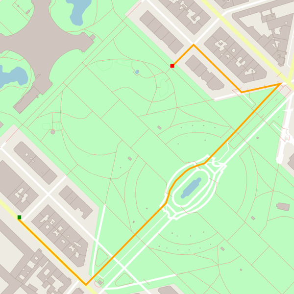

# Route Planning Project

This repo is a clone of the [Udacity Route Planning Project](https://github.com/udacity/CppND-Route-Planning-Project) with my answers for the C++ NanoDegree project 1.




### Cloning

When cloning this project, be sure to use the `--recurse-submodules` flag:  

    git clone https://github.com/FLinguenheld/CppND-Route-Planning-Project --recurse-submodules

### Dependencies for Running Locally
* cmake >= 3.11.3
* make >= 4.1
* gcc/g++ >= 7.4.0
* IO2D
  * Installation instructions for all operating systems can be found [here](https://github.com/cpp-io2d/P0267_RefImpl/blob/master/BUILDING.md)
  * This library must be built in a place where CMake `find_package` will be able to find it
 

### Compiling and Running

#### Compiling
To compile the project, first, create a `build` directory and change to that directory:

    mkdir build && cd build

From within the `build` directory, then run `cmake` and `make` as follows:

    cmake ..
    make

#### Running
The executable will be placed in the `build` directory. From within `build`, you can run the project as follows:

    ./OSM_A_star_search

Or to specify a map file:

    ./OSM_A_star_search -f ../<your_osm_file.osm>

### Testing

The testing executable is also placed in the `build` directory. From within `build`, you can run the unit tests as follows:

    ./test

### Troubleshooting

For Debian, you can follow these steps for the IO2D installation:  
   ```
	sudo apt update
	sudo apt install build-essential
	sudo apt install cmake
	sudo apt install libcairo2-dev
	sudo apt install libgraphicsmagick1-dev
	sudo apt install libpng-dev

	git clone --recurse-submodules https://github.com/cpp-io2d/P0267_RefImpl
	cd P0267_RefImpl
	mkdir Debug
	cd Debug
	cmake --config Debug "-DCMAKE_BUILD_TYPE=Debug" ..
	cmake --build .
	sudo make install
   ```
